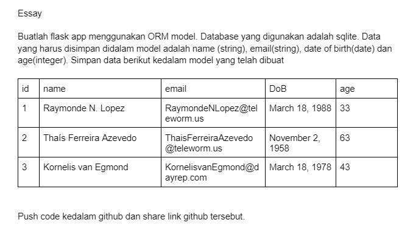

# Flask ORM - Users

This task is about implementation of Flask API using ORM (Object Relational Mapping).

## Task

## URLs
The defualt port for this project is `http://127.0.0.1:5000`. But, I made the URL for Users: `http://127.0.0.1:5000/users`. You can either use the default or custom URL for Users. The task is only show the users and add a user. Furthermore, I will also implement for update and delete operations. :)

## How to install

1. Clone this project by typing command: `git clone https://github.com/ekoteguh10/Flask-ORM.git`
2. Install virtualenv on this project. You may use this command: `python -m venv env`
3. Activate the environment using command: `source env/bin/activate` for Mac/Linux or `env/Scripts/activate.bat` for Windows
4. Install dependencies by using command: `pip install -r requirements.txt`
5. Run this project using command: `python main.py`